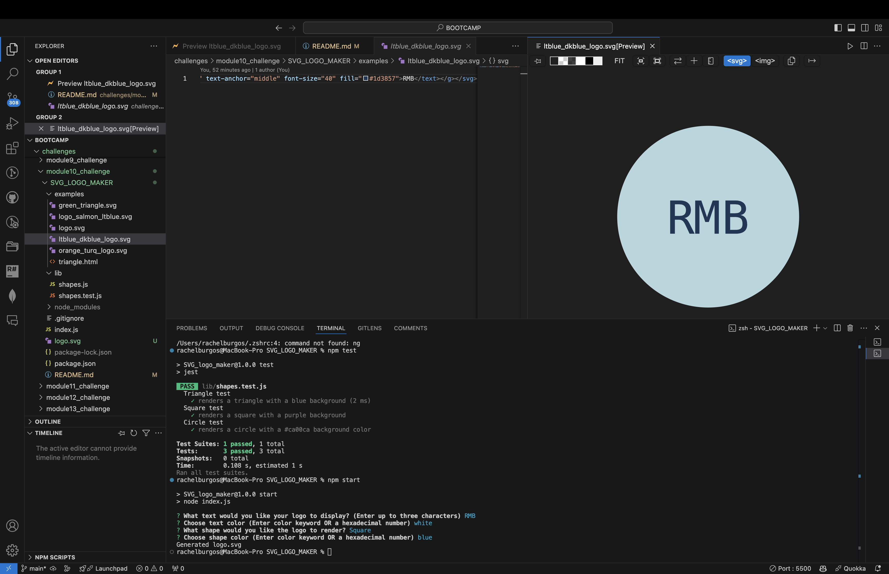
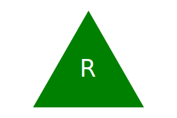
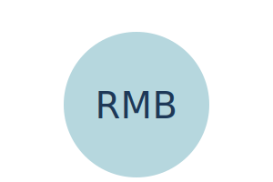
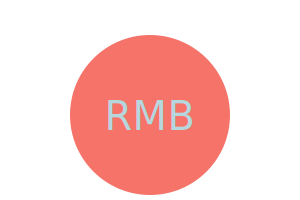

# Module 10 Object-oriented Programming Challenge: SVG Logo Maker

## Description

The SVG Logo Maker is a command-line application that allows users to generate a simple, customizable SVG logo by inputting text, colors, and shapes. This tool is particularly useful for quickly creating logo concepts or placeholder images for projects. Users can define the logo’s text, text color, shape, and shape color, and the application will output an SVG file with the specified criteria.

## Table of Contents

- [Installation](#installation)
- [Usage](#usage)
- [Features](#features)
- [Examples](#examples)
- [License](#license)

## Installation

To use this application, you need to have [Node.js](https://nodejs.org/) installed.

1. Clone the repository to your local machine:
   ```bash
   git clone <repository-url>


2. Navigate to the project directory:
`bash`

`cd SVG-Logo-Maker`

3. Install the required dependencies:
`bash`

`npm install`

## Usage

[]

*** Run the application using the following command:

`bash`

`node index.js`
The application will guide you through a series of prompts to gather the necessary information for generating the logo.

## Features

- The application provides the following functionality:

- ***Text Input:**
Prompts the user to enter text for the logo, limited to 3 characters (e.g., "ABC").
- ***Text Color:**
Prompts the user to enter a color for the text. The color can be either a color keyword (e.g., "blue") or a hexadecimal color code (e.g., "#0000FF").
- ***Shape Selection:**
  - Provides a list of shapes to choose from: circle, triangle, or square.
  - Shape Color:
  - Prompts the user to enter a color for the shape, accepting color keywords or hexadecimal codes.


**SVG Generation:**

After gathering all input, the application generates an SVG file named logo.svg with a size of 300x200 pixels that matches the user's specifications.
The application outputs "Generated logo.svg" in the command line once the file is created.
Examples

### Example Walkthrough Video

[](https://img.youtube.com/vi/_V7TPJLZeJY/0.jpg)


### Run the Application:
`bash`

`node index.js`
**Prompts:**
- npm Text: Enter up to 3 characters for the logo text (e.g., "ABC").
- Text Color: Specify the text color as a keyword (e.g., "blue") or hexadecimal (e.g., "#FF5733").
- Shape: Select the shape for the logo (circle, triangle, or square).
- Shape Color: Specify the shape color using a color keyword or hexadecimal value.
**Output:**
- Once all prompts are completed, the application creates a file named logo.svg.
The message "Generated logo.svg" confirms that the file was successfully created.

## Viewing the Logo:

**Open logo.svg in a web browser to view your custom logo design.**

**Sample Input and Output**






Input:
Text: JS
Text Color: #4CAF50 (Green)
Shape: Circle
Shape Color: #FFC107 (Amber)
Output:
The application generates logo.svg displaying the text "JS" in green on an amber circle, with the file ready for viewing in a browser.
License

## Contributors
\*\* This project was accomplished with the help provided by the instructors and TAs of the Rice University Coding Bootcamp, including Instructor Darian Mendez, Mateo Wallace, Mark Alfano, Gerard Mennella


## References

- <https://developer.mozilla.org/en-US/docs/Web/SVG/Tutorial>

- <https://developer.mozilla.org/en-US/docs/Web/SVG/Tutorial/Basic_Shapes>

- <https://marketplace.visualstudio.com/items?itemName=jock.svg>

- <https://developer.mozilla.org/en-US/docs/Web/SVG/Tutorial/Texts>

## License

This project is licensed under the MIT License.

